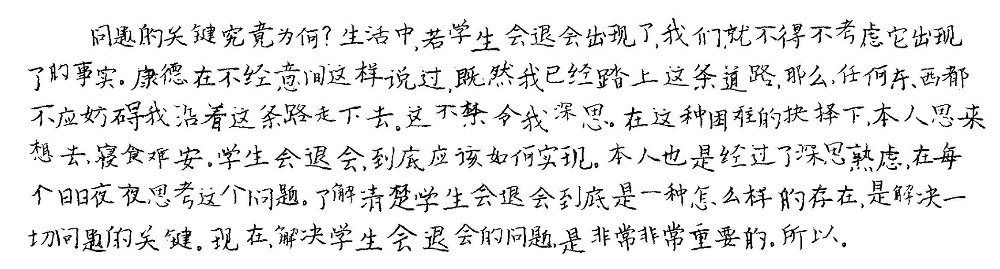

# 1. 说明

通过 handright 包实现手写字体生成，用于偷懒

# 2. 使用方法

确定是否使用自定义图片

## 2.1. 使用自定义图片

在 `bac` 目录下放入需要的图片，在 main.py 相关处改变代码块。

```python
template = Template(
    # background=Image.open('bac/01.png'),  # 自定义背景图片
    # 这是 300ppi 的标准 A4
    background=Image.new(mode="1", size=(2479, 3508),color=1),
    .......
```

## 2.2. 不使用自定义图片

文件内置了标准 A4 背景。

首先在 `text` 文件夹放入你的 word 文件，在 `font` 文件夹放入需要的字体，并于`main.py` 相关处改变代码块。

```python
if __name__ == "__main__":
    .......
    text = get_text('temp.docx')  # 根目录下的word文档
    f_type = '01.ttf'  # 字体选择
    .......
```

然后启用 `main.py`，会在 `save` 文件夹生成输出好的图片，在根目录生成的 `result.pdf` 为上述图片的集合 pdf 文件。

## 2.3. 效果展示



或可见 result.pdf
